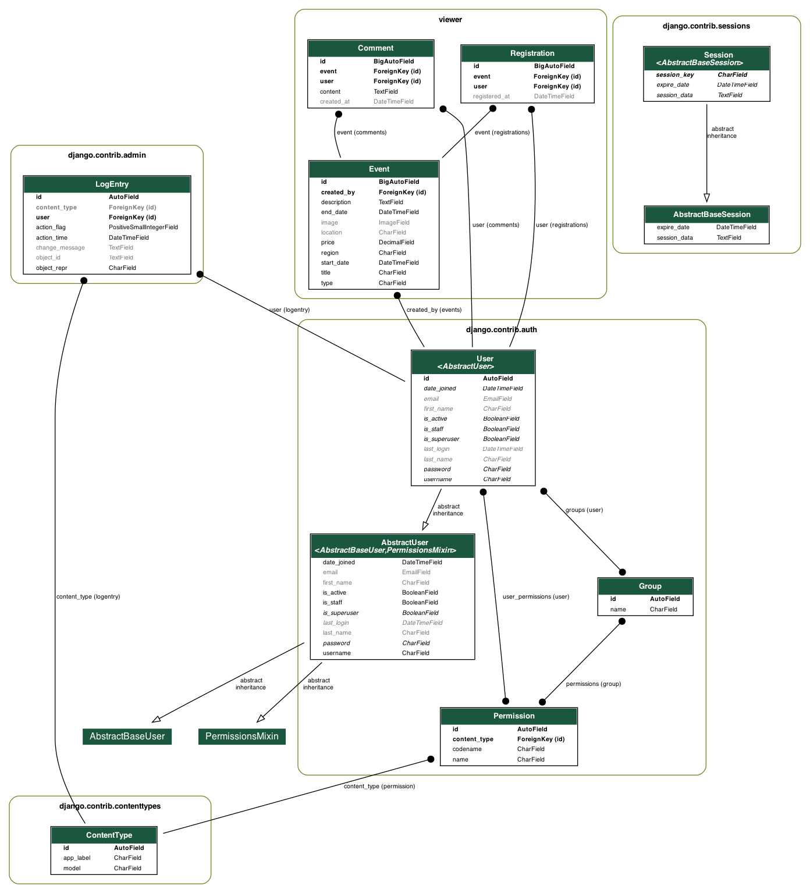
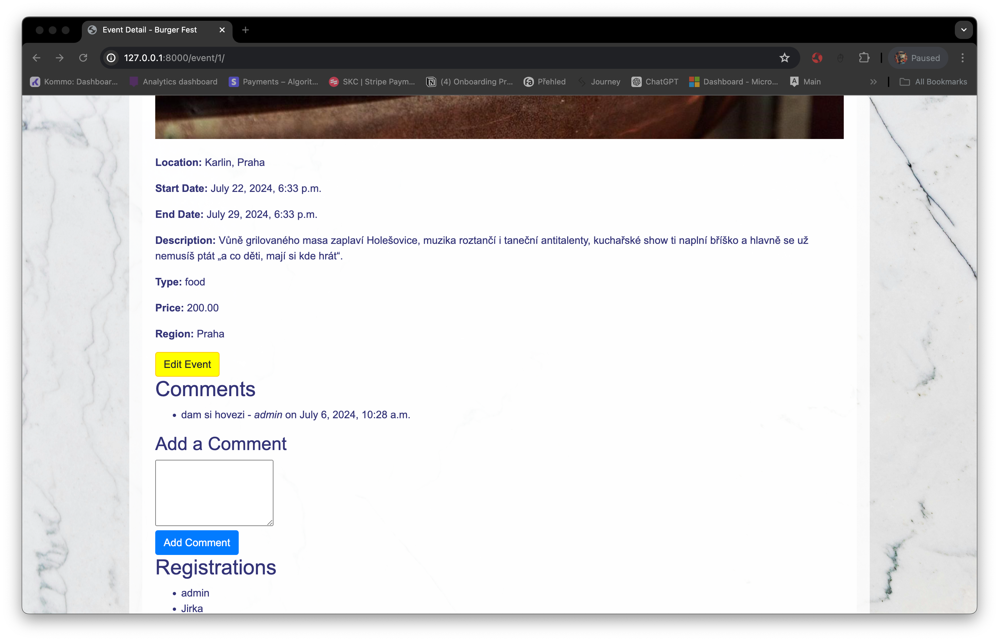

# Eventify

Eventify is a web application for managing and registering for events. It allows users to search for events, register for them, and view details about each event.

## Features
- User registration and authentication
- Event creation, editing, and deletion by admins
- Event search and filtering
- User event registration and unregistration
- Comments on events

## ER Diagram
Below is the Entity-Relationship (ER) diagram for the Eventify application:

## Screenshots
### Homepage


### Event Detail


## Installation
To install and run this project locally:

1. Clone the repository:
   ```bash
   git clone https://github.com/yourusername/eventify.git
   cd eventify
